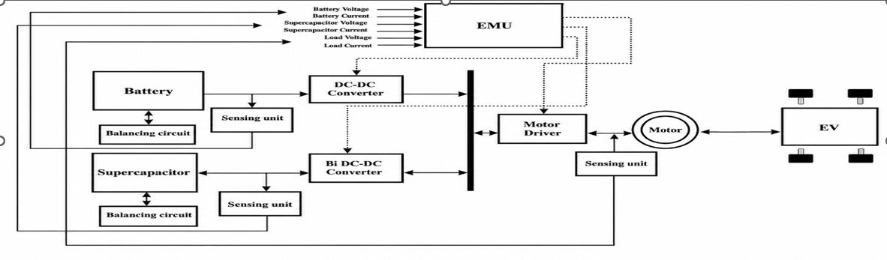
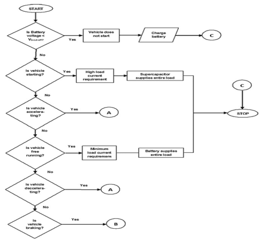
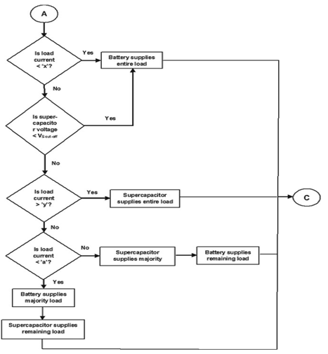
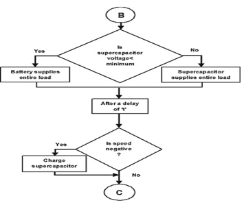
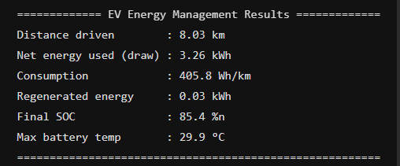
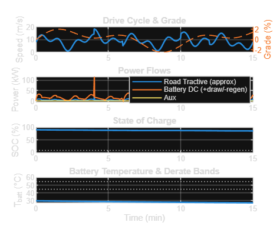
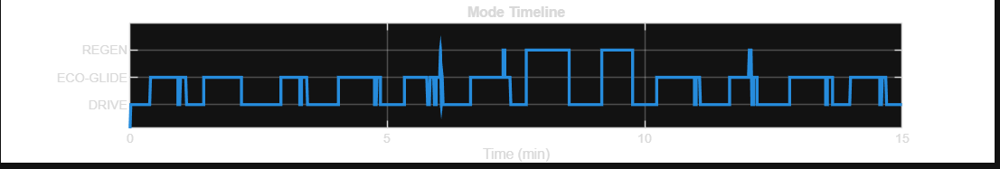

# 🚗 Energy Efficient Management Algorithm for Electric Vehicles

> MATLAB-Based Intelligent Energy Management System (EMS) Using Hybrid Energy Storage (Battery + Supercapacitor)

---

## 📖 Overview

The transportation industry is rapidly transitioning toward Electric Vehicles (EVs) to reduce carbon emissions and improve energy sustainability. Despite their advantages, EVs face challenges such as limited driving range, battery degradation, high current stress during acceleration, and inefficient utilization of regenerative braking energy.

This project presents an **Energy Efficient Management Algorithm (EEMA)** developed using **MATLAB**. The proposed Energy Management System intelligently controls power flow between a **Lithium-Ion Battery** and a **Supercapacitor** using a **Hybrid Energy Storage System (HESS)** architecture.

The system dynamically allocates power based on vehicle operating conditions such as startup, acceleration, cruising, deceleration, and braking to maximize efficiency, reduce battery stress, and improve vehicle performance.

---

## 🎯 Project Objectives

* Design an intelligent Energy Management System for Electric Vehicles.
* Optimize power sharing between Battery and Supercapacitor.
* Reduce battery stress during high current demand.
* Improve battery lifespan.
* Implement regenerative braking energy recovery.
* Monitor Battery State of Charge (SOC).
* Monitor battery thermal behavior.
* Improve overall vehicle energy efficiency.
* Analyze energy consumption under varying drive-cycle conditions.

---

## ⚡ Problem Statement

In conventional EVs, the battery is solely responsible for supplying vehicle power under all operating conditions. During rapid acceleration and startup, high current demand causes:

* Increased battery degradation
* Higher thermal stress
* Reduced efficiency
* Shortened battery life

Additionally, braking energy is often underutilized.

To overcome these limitations, this project introduces a Hybrid Energy Storage System consisting of a Battery and Supercapacitor controlled by an intelligent Energy Management Unit (EMU).

---

# 🏗 System Architecture

## Block Diagram



### Architecture Description

The proposed system consists of:

### 🔋 Battery Pack

The primary energy storage unit responsible for supplying energy during normal driving conditions.

Functions:

* Energy storage
* Vehicle propulsion support
* SOC monitoring
* Thermal monitoring

### ⚡ Supercapacitor

The supercapacitor acts as a high-power auxiliary energy storage element.

Functions:

* Startup assistance
* Acceleration support
* Regenerative braking energy storage
* Peak current reduction

### 🧠 Energy Management Unit (EMU)

The EMU is the decision-making controller of the system.

Inputs monitored by EMU:

* Battery Voltage
* Battery Current
* Supercapacitor Voltage
* Supercapacitor Current
* Load Voltage
* Load Current

The EMU continuously evaluates system conditions and determines the optimal power source.

### 🔄 Bidirectional DC-DC Converter

Responsible for energy transfer between Battery, Supercapacitor, and Motor Drive.

Functions:

* Voltage regulation
* Energy balancing
* Controlled power transfer

### ⚙ Motor Driver and Motor

The Motor Driver controls the electric motor.

Operating Modes:

#### Motoring Mode

Electrical Energy → Mechanical Energy

#### Regenerative Mode

Mechanical Energy → Electrical Energy

### 📡 Sensing Unit

Continuously monitors:

* Voltage
* Current
* Temperature
* Vehicle Speed
* Power Demand

for real-time decision making.

---

# 🔋 Battery Management System (BMS)

## BMS Flowchart



### Purpose

The Battery Management System ensures safe operation of the battery under all operating conditions.

### Key Functions

* Battery voltage monitoring
* Startup validation
* Charging control
* Deep discharge protection
* Battery protection

### Operational Logic

1. Verify battery voltage.
2. Check startup eligibility.
3. Detect vehicle operating mode.
4. Transfer control to EMS controller.

---

# ⚙ Decision-Based Energy Management Algorithm

## Decision Algorithm Flowchart



### Purpose

The algorithm determines the optimal power-sharing strategy between Battery and Supercapacitor.

### Low Load Region

Condition:

Load Current < X

Action:

Battery supplies entire load.

### Medium Load Region

Condition:

X < Load Current < Y

Action:

Battery supplies majority load.

Supercapacitor supplies remaining load.

### High Load Region

Condition:

Load Current > Y

Action:

Supercapacitor supplies entire load.

### Supercapacitor Protection

Condition:

VSC < Vcutoff

Action:

Battery assumes complete load responsibility.

---

# ♻ Energy Flow Control and Regenerative Braking

## Energy Flow Control Flowchart



### Regenerative Braking Sequence

1. Vehicle enters braking mode.
2. Motor operates as a generator.
3. Kinetic energy is converted into electrical energy.
4. Recovered energy is stored in the Supercapacitor.
5. Excess energy is redirected to the Battery.

### Benefits

* Increased vehicle range
* Improved efficiency
* Reduced energy losses
* Reduced battery degradation

---

# 💻 MATLAB Implementation

The complete Energy Management System was developed using MATLAB.

### Implemented Modules

* Vehicle Dynamics Model
* Battery Model
* Supercapacitor Model
* Thermal Model
* Energy Management Controller
* Regenerative Braking Controller
* SOC Estimation Model
* Power Flow Analysis Module

### Inputs

* Vehicle Speed
* Road Grade
* Battery Voltage
* Battery Temperature
* Load Current
* Supercapacitor Voltage

### Outputs

* Battery Power
* Vehicle Power Demand
* Regenerated Energy
* Battery SOC
* Battery Temperature
* Operating Mode

---

# 📊 Simulation Results

## Simulation Summary



### Performance Metrics

| Parameter                   | Value       |
| --------------------------- | ----------- |
| Distance Driven             | 8.03 km     |
| Net Energy Used             | 3.26 kWh    |
| Energy Consumption          | 405.8 Wh/km |
| Regenerated Energy          | 0.03 kWh    |
| Final SOC                   | 85.4 %      |
| Maximum Battery Temperature | 29.9 °C     |

---

# 📈 EV Performance Analysis

## Drive Cycle, Power Flow, SOC and Thermal Analysis



### Drive Cycle Analysis

The vehicle is subjected to varying speed and road-grade conditions to emulate real-world urban driving.

### Power Flow Analysis

The EMS dynamically manages:

* Road Traction Power
* Battery Power
* Auxiliary Loads

based on operating conditions.

### SOC Analysis

Initial SOC: 90 %

Final SOC: 85.4 %

The gradual decrease indicates efficient battery utilization.

### Thermal Analysis

Maximum Battery Temperature:

29.9 °C

The battery remains within safe thermal operating limits.

---

# 📉 Vehicle Operating Modes

## Mode Timeline



The EMS dynamically switches between:

### DRIVE Mode

Battery supplies propulsion power.

### ECO-GLIDE Mode

Vehicle coasting operation with reduced energy consumption.

### REGEN Mode

Activated during braking for energy recovery.

---

# 🚀 Technical Contributions

## Hybrid Energy Storage System

Combines:

### Lithium-Ion Battery

Advantages:

* High Energy Density
* Long Driving Range

### Supercapacitor

Advantages:

* High Power Density
* Fast Charging
* Fast Discharging

This hybrid approach combines the strengths of both technologies.

---

## Intelligent Power Sharing

The Energy Management Unit dynamically selects:

* Battery Mode
* Supercapacitor Mode
* Hybrid Mode

based on operating conditions.

---

## Regenerative Braking

The system successfully recovers braking energy and stores it for future utilization.

---

## Thermal Protection

Battery temperature is continuously monitored to ensure safe operation.

---

## Battery Life Enhancement

Peak current stress on the battery is reduced through intelligent power sharing.

---

# ✅ Advantages

* Improved Energy Efficiency
* Increased Driving Range
* Reduced Battery Stress
* Enhanced Battery Life
* Better Thermal Management
* Efficient Regenerative Braking
* Intelligent Power Distribution
* Reduced Energy Losses

---

# 🔮 Future Scope

Potential future enhancements include:

* AI-Based Energy Management
* Machine Learning Battery Health Prediction
* Hardware-in-the-Loop (HIL) Testing
* IoT-Based Monitoring
* Cloud Analytics
* Smart Charging Integration
* Solar-Assisted Charging
* Real-Time Embedded Controller Implementation

---

# 🛠 Tools & Technologies

| Category          | Technology                    |
| ----------------- | ----------------------------- |
| Programming       | MATLAB                        |
| Simulation        | MATLAB Simulink               |
| Control System    | Energy Management Unit        |
| Energy Storage    | Battery + Supercapacitor      |
| Power Electronics | Bidirectional DC-DC Converter |
| Monitoring        | SOC & Thermal Monitoring      |
| Energy Recovery   | Regenerative Braking          |

---

# 📁 Repository Structure

```text
energy_efficient_algorithm/
│
├── src/
│   └── ev.m
│
├── doc/
│   ├── ems_block_diagram.png
│   ├── ems_bms_flowchart.png
│   ├── ems_decision_algorithm.png
│   └── ems_energy_flow_control.png
│
├── graph/
│   ├── simulation_summary_results.png
│   ├── ev_performance_analysis.png
│   └── vehicle_mode_timeline.png
│
├── project_report.pdf
├── project_ppt.pptx
└── README.md
```

---

# 👨‍💻 Author

**Suraksha K S**

Bachelor of Engineering (Electronics & Communication Engineering)

Dr. Ambedkar Institute of Technology, Bengaluru

**Internship Organization:** VisionAstraa EV Academy

**Project Title:** Energy Efficient Management Algorithm for Electric Vehicles

---

## References

1. VisionAstraa EV Academy Internship Material.
2. Electric Vehicle Energy Management System Concepts.
3. Battery Management System (BMS) Design Principles.
4. Hybrid Energy Storage System Research.
5. MATLAB-Based Simulation and Analysis.
